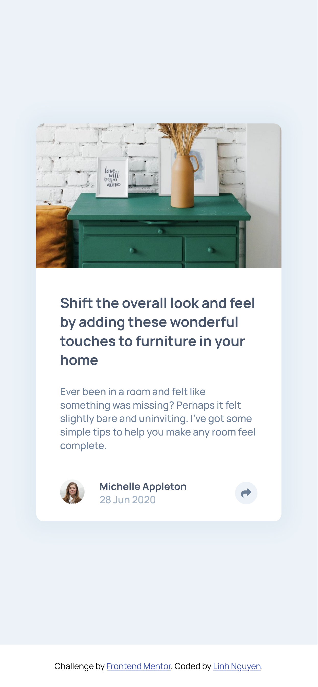

# Frontend Mentor - Article preview component solution

## Table of contents

- [Overview](#overview)
  - [The challenge](#the-challenge)
  - [Screenshot](#screenshot)
  - [Links](#links)
- [My process](#my-process)
  - [Built with](#built-with)
  - [What I learned](#what-i-learned)
  - [Useful resources](#useful-resources)
- [Author](#author)

## Overview

### The challenge

Users should be able to:

- View the optimal layout for the component depending on their device's screen size
- See the social media share links when they click the share icon

### Screenshot

_1. Desktop review_


_2. Desktop active state review_


_3. Mobile review_



_4. Mobile active state review_


### Links

<!-- - Solution URL: [Add solution URL here](https://your-solution-url.com) -->
- Live Site URL: [Article preview component live page](https://auri222.github.io/Article-preview-component-HTML-CSS-JS/)

## My process

### Built with

- Semantic HTML5 markup
- CSS custom properties
- Javascript
- Flexbox
- Mobile-first workflow

### What I learned

- The button background color didn't appear when the share links list took place on the mobile screen => Add a position for it to change stacking order of the webpage, and make the button on top of the list.

```css
button#shareBtn {
  border: none;
  outline: none;
  border-radius: 50%;
  padding: 8px;
  display: flex;
  align-items: center;
  background-color: var(--LightGrayishBlue);
  cursor: pointer;
  position: relative; /* Fixed background-color not appearing*/
  z-index: 3;
}

#shareLinks.mobilePopup {
  width: 100%;
  position: absolute; /* This will make the list on top of the button when appears*/
  left: 0;
  bottom: 0;
  gap: 1.5rem;
  padding: 1.975rem 2.5rem;
  border-radius: 0 0 10px 10px;
  z-index: 2;
  opacity: 0;
  visibility: hidden;
  transition: opacity 500ms ease-in-out;
}
```

- Add or remove a class on different screen sizes:

```js
window.onload = () => {
  screenWidth = window.innerWidth;
  if (screenWidth < 768) {
    popupLinks.classList.add("mobilePopup");
    popupLinks.classList.remove("desktopPopup");
  } else {
    popupLinks.classList.add("desktopPopup");
    popupLinks.classList.remove("mobilePopup");
  }
};
```

### Useful resources

- [4 reasons your z-index isn’t working (and how to fix it) - Jessica Chan](https://www.freecodecamp.org/news/4-reasons-your-z-index-isnt-working-and-how-to-fix-it-coder-coder-6bc05f103e6c/) - This helped me to fix the button background color not appearing when in mobile active mode.
- [Image not covering the whole "div" area (solution)](https://stackoverflow.com/questions/56412554/image-not-covering-the-whole-div-area)


## Author

- Frontend Mentor - [@auri222](https://www.frontendmentor.io/profile/auri222)